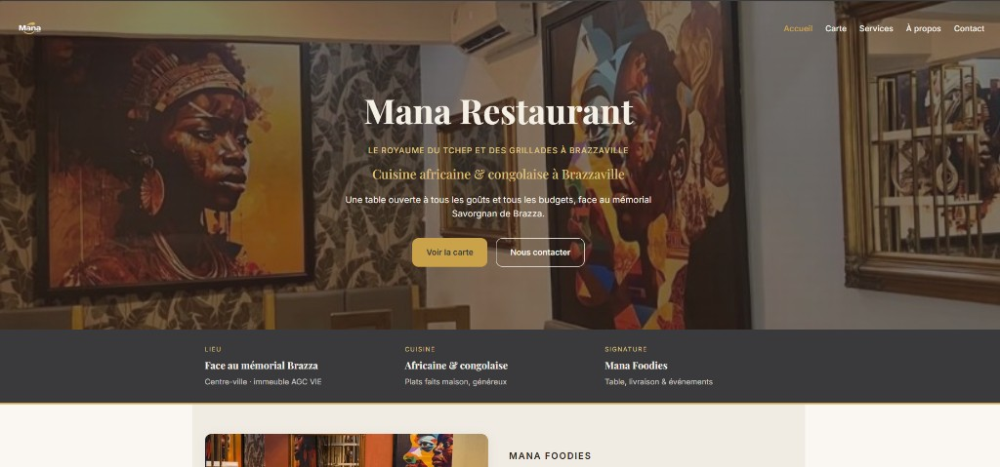
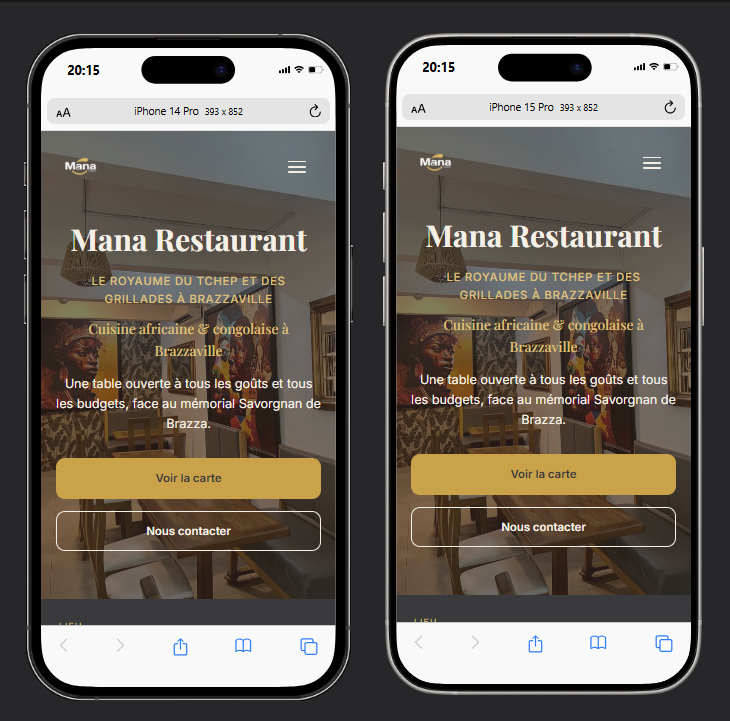

<div align="center">

# Mana Restaurant — Site vitrine

**Site vitrine responsive en HTML et CSS pour Mana Restaurant à Brazzaville**

[](https://developer.mozilla.org/fr/docs/Web/HTML)
[](https://developer.mozilla.org/fr/docs/Web/CSS)
[](https://akieni.com)
[](https://validator.w3.org/)

</div>

---

## À propos

Site vitrine de **Mana Restaurant**, une adresse de cuisine africaine et congolaise située au centre-ville de Brazzaville, face au mémorial Savorgnan de Brazza.

Le site présente l’établissement, sa carte, ses services et ses coordonnées dans une identité visuelle chaleureuse inspirée de la signature **Mana Foodies**.

> HTML5 · CSS3 · Flexbox · Grid · media queries 768px et 480px · menu mobile en CSS

## Aperçu



### Mobile



## Fonctionnalités

- Hero avec image de fond et appels à l’action
- Présentation du restaurant et de son ambiance
- Carte complète avec plats et prix en FCFA
- Galerie responsive de plats et du restaurant
- Présentation des services : sur place, livraison, traiteur et événements
- Formulaire de contact
- Carte Google Maps intégrée
- Footer avec coordonnées et réseaux sociaux
- Menu burger mobile réalisé uniquement en CSS
- Mise en page responsive pour mobile, tablette et ordinateur
- Respect de la préférence de réduction des animations

## Pages

| Page | Contenu |
|---|---|
| Accueil | Hero, présentation, ambiance, plats et services |
| Carte | Catégories, photos des plats et prix |
| Services | Sur place, livraison, traiteur et événements |
| À propos | Histoire, horaires et cadre du restaurant |
| Contact | Coordonnées, formulaire et localisation |

## Installation

Télécharger ou cloner le dépôt, puis ouvrir le dossier du projet :

```bash
git clone URL_DU_DEPOT
cd "mana_restaurant"
```

Ouvrir ensuite `index.html` dans le navigateur. L’utilisation de **Live Server** est optionnelle.

## Utilisation

| Écran | Comportement |
|---|---|
| Ordinateur | Navigation horizontale et grilles sur plusieurs colonnes |
| Tablette (≤ 768px) | Menu burger et grilles adaptées |
| Mobile (≤ 480px) | Menu burger et contenu sur une colonne |

## Structure

```text
mana_restaurant/
├── index.html
├── Pages/
│   ├── index.html
│   ├── carte.html
│   ├── services.html
│   ├── a-propos.html
│   └── contact.html
├── Css/
│   └── style.css
├── images/
│   ├── icones/
│   ├── Plats/
│   └── Visuel_restaurant/
├── preview.png
├── preview-mobile.png
└── README.md
```

## Technologies

| Technologie | Utilisation |
|---|---|
| HTML5 | Structure sémantique des cinq pages |
| CSS3 | Mise en forme, couleurs, animations et responsive |
| Flexbox | Navigation, boutons et alignements |
| CSS Grid | Galeries, cartes, plats et sections |
| Variables CSS | Palette, typographies, ombres et dimensions |
| Google Fonts | Playfair Display et Inter |
| Git | Historique du projet avec plus de 10 commits |

## Formulaire

Le formulaire de contact est une démonstration front-end. Il ne transmet pas encore les messages, car aucun service d’envoi ni backend n’est associé au projet.

## Déploiement

Le projet est prévu pour être publié avec **GitHub Pages**:

## Déploiement

Le projet est prévu pour être publié avec **GitHub Pages** :

[https://chal-b.github.io/mana_restaurant/](https://chal-b.github.io/mana_restaurant/)

## Contact

**MALONGA Saint Chalbhery** — [GitHub @Chal-B](https://github.com/Chal-B) — [LinkedIn](https://www.linkedin.com/in/saint-chalbhery-malonga-2784253b2) — saintmlg@icloud.com
